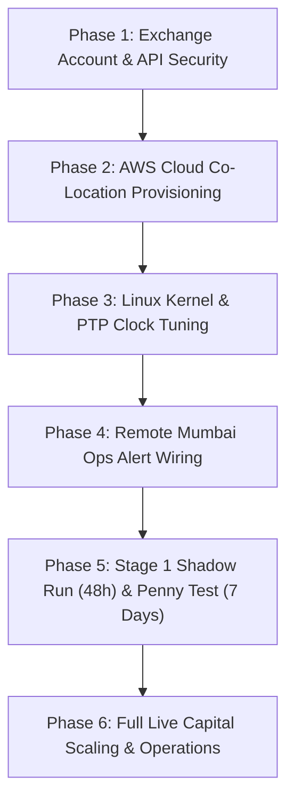

# 🏛️ Master Step-by-Step Live Capital Deployment Playbook

This operational playbook walks you through transitioning your quantitative software suite in `/home/daksh/arbitrage` from a theoretical evaluation environment to a running, multi-region quantitative cryptocurrency arbitrage platform monitored remotely from **Mumbai Operations Control**.

Adhere to this sequential six-phase blueprint to ensure physical security, microsecond latency co-location, strict API isolation, and disciplined capital verification.

---

## 📅 Executive Phase Roadmap



---

## 🔐 Phase 1: Exchange Account & API Security Setup

Before setting up servers, prepare your institutional accounts across our six supported exchange liquidity hubs: **Binance, Bybit, OKX, Gate.io, Coinbase, and Kraken**.

### 1. Create Dedicated Trading Sub-Accounts
* Do not run automated algorithmic strategies out of your personal or main crypto holding account.
* On each exchange, create a dedicated **Sub-Account** (e.g., `QuantArb_Prod`). This ensures complete balance isolation and clean reconciliation mapping inside `inventory_manager.py` without interfering with your manual holdings.

### 2. Configure Institutional Security Options
* Set account Two-Factor Authentication (2FA) using hardware keys (YubiKey) or TOTP apps (Google Authenticator / Authy). Never rely on SMS authentication for automated algorithmic accounts.
* Ensure both **Spot** and **Perpetual Futures (USDT-Margined)** markets are active and accessible under your sub-account profile.

### 3. Generate Secure API Key Pairs (Do Not Whitelist IPs Yet)
* Navigate to the exchange API Management section and create a new API Key & Secret pair for your trading sub-account.
* **Configure Specific API Permissions**:
  * ✅ **Enable Read Information**: Essential for retrieving balances, fee brackets, and real-time orderbook streams.
  * ✅ **Enable Spot Trading**: Needed for routing our low-latency Spot execution legs.
  * ✅ **Enable Futures Trading**: Required for deploying delta-neutral hedges and Post-Only maker unloader protocols in `futures_hedger.py`.
  * ✅ **Enable Internal Transfers**: Crucial for our Cross-Margin Short Squeeze Shield to automatically shift Spot USDT collateral to your Futures wallet during sudden market surges.
  * 🛑 **DISABLE WITHDRAWALS ON PRIMARY KEYS**: Your general execution key pair **must have withdrawals permanently disabled**. 
* **Note on API IP Whitelisting**: Leave the IP whitelist blank temporarily. You will enter your permanent Elastic IP addresses during Phase 2.
* Save your Key and Secret securely in an offline encrypted vault (e.g., Bitwarden or Keybase). Never store plain-text secrets in git repositories.

---

## ☁️ Phase 2: AWS Multi-Region Cloud Server Provisioning

To eliminate cross-ocean speed-of-light propagation delays ($~150\,\text{ms}$ fiber round-trip time between Tokyo and Virginia), deploy two geographically co-located servers directly alongside exchange matching infrastructure.

### 1. Provision Asian Liquidity Server (AWS Tokyo Region - `ap-northeast-1`)
* Log into your AWS Console and switch to the **Asia Pacific (Tokyo)** region.
* Launch a new EC2 instance with the following specs:
  * **Amazon Machine Image (AMI)**: Amazon Linux 2023 or Ubuntu 22.04 LTS (Optimized high-throughput networking kernel).
  * **Instance Type**: `c6i.2xlarge` or `c7g.2xlarge` (8 dedicated vCPUs with zero core sharing, guaranteeing independent execution for our 6 multi-process worker daemons).
  * **Storage**: 50 GB Amazon EBS `gp3` Solid State Drive (High IOPS profile for rapid persistence of `core_dump.json` and real-time analytical records).
  * **Network Placement**: Deploy into availability zones `ap-northeast-1a` or `ap-northeast-1c`, which house low-latency direct connections to Binance and Bybit matching engines.
* **Allocate an Elastic Static Public IP**: Go to *EC2 $\rightarrow$ Elastic IPs*, allocate a new public IP address, and associate it with your Tokyo instance. This static IP serves as your permanent network identifier and will never change upon server restart.

### 2. Provision US Liquidity Server (AWS N. Virginia Region - `us-east-1`)
* Switch your AWS region selector to **US East (N. Virginia)**.
* Repeat the exact provisioning procedure to deploy a second `c6i.2xlarge` server, attaching a new static Elastic IP address for low-latency routing to **Coinbase** and **Kraken**.

### 3. Finalize Exchange API Whitelisting
* Return to your exchange API settings from Phase 1.
* Add your new AWS Tokyo static Elastic IP to your API whitelist on **Binance, Bybit, OKX, and Gate.io**.
* Add your AWS N. Virginia static Elastic IP to your API whitelist on **Coinbase and Kraken**.
* Your API secrets are now physically bounded to these specific server locations; even if leaked, they cannot be executed from unauthorized network IPs.

---

## ⚙️ Phase 3: Linux Kernel Tuning & Repository Setup

Connect via SSH from your terminal in Mumbai to your AWS Tokyo and Virginia servers to install dependencies and apply kernel performance optimizations:
```bash
ssh -i ~/.ssh/your-aws-key.pem ec2-user@<YOUR_AWS_ELASTIC_IP>
```

### 1. Install System Dependencies & Transfer Software
```bash
sudo yum update -y || sudo apt update -y
sudo yum install -y python311 python311-devel git gcc chrony || sudo apt install -y python3-dev git gcc chrony
sudo python3 -m pip install --upgrade pip
sudo python3 -m pip install ujson uvloop requests
```
Copy your local project directory `/home/daksh/arbitrage` to `/home/ec2-user/arbitrage` on both remote server instances via secure SCP or private Git repository transfer.

### 2. Establish Sub-Millisecond PTP Hardware Clock Synchronization
To pass `watchdog.py`'s rigid **$35\,\text{ms}$ maximum quote age delta filter**, configure your server clocks to reference AWS Precision Time Protocol (PTP) hardware stratum servers:
```bash
# Verify AWS Time Sync hardware driver presence
ls /dev/ptp*

# Restart Chrony hardware synchronization daemon
sudo systemctl enable --now chronyd
sudo systemctl restart chronyd

# Verify sub-millisecond precision alignment (System time offset should read < 0.0005 seconds)
chronyc tracking
chronyc sources -v
```

### 3. Optimize Linux Kernel & POSIX Shared Memory Buffer (`/dev/shm`)
Configure system networking parameters to expand socket buffers and eliminate TCP packet bundling delays:
```bash
sudo tee -a /etc/sysctl.conf <<EOF
# Eliminate TCP buffering latency for instantaneous WebSocket transmission
net.ipv4.tcp_fastopen = 3
net.ipv4.tcp_low_latency = 1
net.ipv4.tcp_rmem = 4096 87380 16777216
net.ipv4.tcp_wmem = 4096 65536 16777216
fs.file-max = 2097152
EOF
sudo sysctl -p

# Verify shared memory (/dev/shm) tmpfs volume has at least 4 GB RAM disk capacity
df -h /dev/shm
```

---

## 📲 Phase 4: Remote Mumbai Ops Alert & Telemetry Wiring

Configure push alerting so your mobile device in Mumbai receives real-time operational diagnostics during silent process recoveries or multi-tiered kill-switch interventions.

### 1. Create Your Telegram Operational Command Bot
* Open Telegram on your phone or workstation and search for `@BotFather`.
* Send the command `/newbot`, provide a descriptive display name (e.g., `Mumbai Quant Ops`), and choose a username ending in bot (e.g., `MumbaiArbOps_bot`).
* Record the generated HTTP API Token (e.g., `71829384:ABC123xyz_aBcDeFgHiJ...`).
* Search for your newly created bot in Telegram and send `/start` to activate the dialogue.
* In a local browser, open: `https://api.telegram.org/bot<YOUR_TOKEN>/getUpdates`. Locate the `chat` object in the JSON output and save your personal `id` integer (e.g., `987654321`).

### 2. Inject Alerting Variables into the Engine
On your AWS instance, create an environment configuration file (`.env`) inside `/home/ec2-user/arbitrage/`:
```bash
cat <<EOF > /home/ec2-user/arbitrage/.env
TELEGRAM_BOT_TOKEN="71829384:ABC123xyz_aBcDeFgHiJ"
TELEGRAM_CHAT_ID="987654321"
PAGERDUTY_ROUTING_KEY="your-pagerduty-service-integration-key"
EOF
chmod 600 /home/ec2-user/arbitrage/.env
```
Your internal telemetry handlers (`telemetry_agent.py` and `circuit_breaker.py`) are engineered to recognize these environment credentials and issue automated notifications whenever anomalous operational events occur.

---

## 🧪 Phase 5: Stage 1 Shadow Run & Stage 2 "Penny Test"

**Do not activate large-scale order execution on Day 1.** Execute a disciplined, phased integration schedule to validate matching latency, real-world fee structures, and execution precision.

```
+-------------------------------------------------------------------------+
|                  THE TWO-STAGE VERIFICATION PIPELINE                   |
+-------------------------------------------------------------------------+
|  STAGE 1: 48-HOUR SHADOW RUN (Dry-Run / Zero Capital Exposure)         |
|  • Read-only WebSocket stream connection without API execution keys.    |
|  • Audit Mark-out Trade Toxicity against Global Composite consensus.   |
|  • Confirm Seqlock stability and systemd MemoryMax limit adherence.     |
+-------------------------------------------------------------------------+
                                     |
                                     v
+-------------------------------------------------------------------------+
|  STAGE 2: 7-DAY PENNY TEST (Micro-Capital Live Execution Validation)    |
|  • Connect authenticated API keys; deposit minimal test capital.       |
|  • Set maximum order sizing to minimal thresholds ($5-$10 USDT/trade).  |
|  • Audit p99 order round-trip latency (<120ms) & verify fee deductions. |
+-------------------------------------------------------------------------+
```

### Stage 1: 48-Hour Shadow Run (Zero Risk Calibration)
Install and launch the system as a background systemd service **without attaching API execution keys**:
```bash
sudo cp /home/ec2-user/arbitrage/arbitrage_engine.service /etc/systemd/system/
sudo systemctl daemon-reload
sudo systemctl enable --now arbitrage_engine
```

#### Verification Metrics to Audit over 48 Hours:
Inspect live logs using `journalctl -u arbitrage_engine -f -n 100`:
1. **Mark-Out Trade Toxicity ($M_{\Delta t}$)**: Verify whether opportunities captured across $t+100\,\text{ms}$ and $t+1\,\text{s}$ show net profitable trajectories when evaluated against the volume-weighted **Global Composite Consensus Index ($P_{\text{composite}}$)** in `analytics_engine.py`.
2. **Seqlock Stability**: Check that your worker processes cycle cleanly without deadlocking on ODD seqlock integers upon automated respawns.
3. **Memory Preservation**: Check that internal RAM consumption stays stable well below the 4 GB systemd limit via bounded ring-buffers.

---

### Stage 2: 7-Day Penny Test (Micro-Sizing Execution)
Once the system clears 48 hours of uninterrupted shadow operation without errors or Alpha Decay warnings:
1. **Deposit Initial Testing Reserves**: Transfer approximately **$\$100$ to $\$250\text{ USDT}$** (plus minor operational equivalents of BTC, ETH, and SOL) into your designated sub-accounts on each exchange.
2. **Configure Minimum Allowable Order Sizing**: In your configuration and `inventory_manager.py`, restrict execution sizing to the minimal exchange allowable threshold (**$\$5.00$ to $\$10.00\text{ USDT}$ per leg**).
3. **Attach Live Authenticated Keys**: Add your encrypted exchange API Key and Secret pairs into your `.env` configuration. Restart the systemd service to activate authenticated execution:
   ```bash
   sudo systemctl restart arbitrage_engine
   ```
4. **Seven-Day Operational Audit Checklist**:
   * **Execution Latency Profile**: Confirm in `latency_profiler.py` reports that your Round-Trip Time ($p_{99}$ RTT) consistently reads below **$120\,\text{ms}$**. If an exchange experiences Congested Throttling above this threshold, evaluate whether network filtering or matching engine queueing caused the lag.
   * **Fee Tier Accuracies**: Verify that realized account profits align with projected spreads after applying standard exchange Taker/Maker trading fee schedules.
   * **Automated Collateral Transfer Test**: Let a simulated short hedge reach testing threshold boundaries to confirm that internal Spot $\rightarrow$ Futures collateral re-collateralization transfers execute reliably under live API rate limits without triggering HTTP 418 bans.

---

## 🏛️ Phase 6: Full Live Capital Scaling & Autonomous Governance

Once your infrastructure clears the 7-day Penny Test with zero unhandled system exceptions or false circuit-breaker activations, transition to full capital allocation:

### 1. Scale Target Inventory Reserves
* Deposit your planned production capital across your exchange sub-accounts.
* Adjust dynamic order sizing limits in `inventory_manager.py` to your desired risk allocation ($25\%$ dynamic deployment cap against actual balance reserves).
* Restart the headless daemon to begin automated execution:
  ```bash
  sudo systemctl restart arbitrage_engine
  ```

### 2. Ongoing Remote Mumbai Monitoring Routine
* Allow the systemd daemon to govern production execution across AWS Tokyo and Virginia servers autonomously without keeping interactive terminal sessions open.
* Depend on your configured Telegram Bot and PagerDuty push notifications for instant remote alerts during market disruptions, trusting the integrated Phase 7 Multi-Tier Drawdown Kill-Switches to protect portfolio equity and dump forensic core telemetry if severe systemic events unfold.

Your quantitative high-frequency cryptocurrency arbitrage platform is deployed, verified, and operational!
